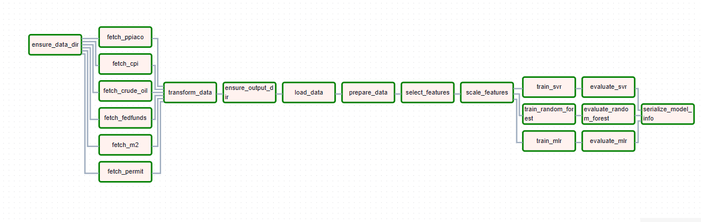
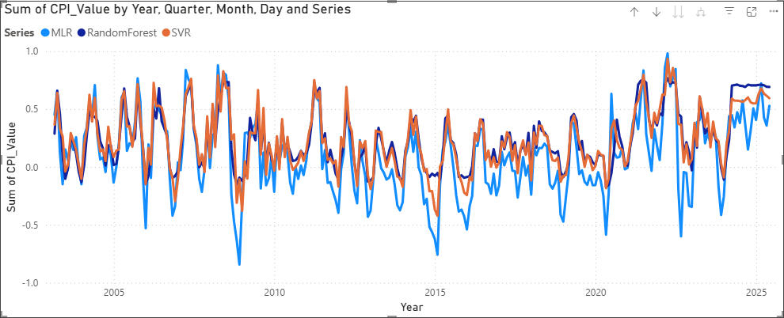

# Inflation Forecasting Project

A comprehensive data pipeline and machine learning system for forecasting inflation rates using economic indicators from the Federal Reserve Economic Data (FRED).


## Overview

This project implements an end-to-end pipeline for inflation forecasting using multiple economic indicators. The system fetches data from FRED, transforms it into a suitable format for time series analysis, trains multiple machine learning models, and outputs predictions and performance metrics for visualization in PowerBI.

## Features

- **Automated Data Ingestion**: Fetches economic indicators from FRED API
- **Data Transformation**: Processes raw data into features suitable for time series forecasting
- **Feature Selection**: Uses LassoCV to identify the most important predictors
- **Multiple Models**: Implements and compares several forecasting approaches:
  - Multiple Linear Regression (MLR)
  - Random Forest Regression
  - Support Vector Regression (SVR) with linear kernel
- **Hyperparameter Tuning**: Automatically finds optimal parameters for each model
- **Model Evaluation**: Compares models using RMSE, MAE, and R-squared metrics
- **Airflow Integration**: Orchestrates the entire pipeline with Apache Airflow
- **PowerBI Visualization**: Outputs formatted data for visualization in PowerBI

## Project Structure

```
inflation_forecasting/
├── dags/                           # Airflow DAG definitions
│   ├── inflation_forecasting_dag.py  # Main DAG file
│   └── inflation_modules/          # Python modules for the pipeline
│       ├── ingest.py               # Data ingestion from FRED
│       ├── transform.py            # Data transformation and feature engineering
│       └── model_steps.py          # Machine learning model implementation
├── data/                           # Data storage
│   ├── raw/                        # Raw data from FRED
│   └── model_output/               # Model outputs and predictions
├── test_model.py                   # Test script for the model
├── test_model_steps.py             # Test script for individual model steps
└── README.md                       # Project documentation
```

## Pipeline Workflow

The inflation forecasting pipeline consists of the following steps:


*Pipeline workflow diagram showing the data flow from ingestion to visualization*

1. **Data Ingestion**:
   - Fetch monthly economic indicators from FRED
   - Store raw data in CSV format

2. **Data Transformation**:
   - Merge data from different sources
   - Create lag features and rolling statistics
   - Handle missing values and outliers
   - Prepare data for time series modeling

3. **Feature Selection**:
   - Apply LassoCV to identify the most important predictors
   - Reduce dimensionality for better model performance

4. **Model Training**:
   - Train multiple models with different approaches
   - Perform hyperparameter tuning for each model
   - Select the best model configuration

5. **Model Evaluation**:
   - Calculate performance metrics (RMSE, MAE, R-squared)
   - Compare model performance
   - Generate predictions for visualization

6. **Serialization**:
   - Save trained models in pickle format
   - Export performance metrics and predictions for PowerBI

## Models

The project implements and compares the following models:

### Multiple Linear Regression (MLR)
- Baseline model that captures linear relationships between features and inflation
- Simple and interpretable approach

### Random Forest Regression
- Ensemble method that captures non-linear relationships
- Handles complex interactions between features
- Less prone to overfitting

### Support Vector Regression (SVR) with Linear Kernel
- Robust to outliers
- Effective for high-dimensional data
- Good generalization performance

## Airflow DAG

The project uses Apache Airflow to orchestrate the pipeline. The DAG is structured as follows:

1. **Data Ingestion Tasks**:
   - Ensure data directory exists
   - Fetch each FRED series

2. **Data Transformation Task**:
   - Transform and merge the data

3. **Modeling Tasks**:
   - Ensure output directory exists
   - Load transformed data
   - Prepare data for modeling
   - Select features using LassoCV
   - Scale features
   - Train MLR model
   - Train Random Forest model
   - Train SVR model
   - Evaluate each model
   - Serialize model information

## PowerBI Visualization

The project outputs data in formats suitable for visualization in PowerBI:


*Sample PowerBI dashboard showing model performance and predictions*

- **model_comparison.csv**: Contains performance metrics for each model
- **model_predictions.csv**: Contains actual CPI values and predictions from each model
- **model_comparison.json**: JSON format of the comparison metrics for PowerBI

In PowerBI, you can create:
- Line charts comparing actual vs. predicted inflation rates
- Bar charts comparing model performance metrics
- Scatter plots showing prediction errors
- Time series visualizations of inflation trends

## Getting Started

### Prerequisites

- Python 3.8+
- Apache Airflow
- PowerBI Desktop (for visualization)
- Docker (recommended but optional)

### Installation

#### Option 1: Standard Installation

1. Clone the repository:
```bash
git clone https://github.com/yourusername/inflation-forecasting.git
cd inflation-forecasting
```

2. Create and activate a virtual environment:
```bash
python -m venv .venv
source .venv/bin/activate  # On Windows: .venv\Scripts\activate
```

3. Install dependencies:
```bash
pip install -r requirements.txt
```

#### Option 2: Docker Installation

1. Pull the Docker image from DockerHub:
```bash
docker pull ibrahimkiani/inflation-forecasting:latest
```

2. Alternatively, build the Docker image locally:
```bash
git clone https://github.com/yourusername/inflation-forecasting.git
cd inflation-forecasting
docker build -t inflation-forecasting .
```

### Running the Pipeline

#### Option 1: Local Testing

To test the pipeline locally:

```bash
python test_model_steps.py
```

This will run each step of the modeling pipeline in sequence and output the results.

#### Option 2: Using Docker

1. Run the Docker container:
```bash
docker run -p 8080:8080 -v $(pwd)/data:/app/data ibrahimkiani/inflation-forecasting:latest
```

2. For interactive mode:
```bash
docker run -it -p 8080:8080 -v $(pwd)/data:/app/data ibrahimkiani/inflation-forecasting:latest /bin/bash
```

3. Run the test script inside the container:
```bash
python test_model_steps.py
```

#### Option 3: Airflow Deployment

1. Copy the DAG files to your Airflow dags folder:
```bash
cp -r dags/* /path/to/airflow/dags/
```

2. Start the Airflow webserver and scheduler:
```bash
airflow webserver --port 8080
airflow scheduler
```

3. Access the Airflow UI at http://localhost:8080 and enable the `inflation_forecasting` DAG.

### Visualizing Results in PowerBI

1. Open PowerBI Desktop
2. Import the CSV files from the `data/model_output` directory:
   - `model_comparison.csv`
   - `model_predictions.csv`
3. Create visualizations to compare model performance and predictions
4. Create a dashboard to monitor inflation forecasts

## Results

The models are evaluated using multiple metrics:

| Model | RMSE | MAE | R² |
|-------|------|-----|---|
| MLR | 0.2312 | 0.1862 | 0.5628 |
| Random Forest | 0.2403 | 0.1890 | 0.5274 |
| SVR | 0.2140 | 0.1672 | 0.6252 |

The SVR model with linear kernel performs best across all metrics, with the lowest RMSE and MAE, and the highest R-squared value.

## Performance Optimizations

The model training process has been optimized to improve performance:

1. **Random Forest Training**:
   - Replaced GridSearchCV with pre-optimized parameters based on previous runs
   - Parameters used: `max_depth=10, min_samples_leaf=4, min_samples_split=2, n_estimators=50`
   - Added `n_jobs=-1` to use all available CPU cores

2. **SVR Training**:
   - Replaced GridSearchCV with pre-optimized parameters based on previous runs
   - Parameters used: `kernel='linear', C=0.1, epsilon=0.01`

3. **LassoCV Feature Selection**:
   - Reduced number of alpha values to try (from 50 to 20)
   - Reduced number of CV splits (from 5 to 3)
   - Increased max iterations (from 10,000 to 100,000)
   - Increased tolerance for faster convergence (from 0.0001 to 0.001)
   - Added `n_jobs=-1` to use all available CPU cores
   - Added fallback to select top 20 features if too few are selected

4. **MLR Training**:
   - Added `n_jobs=-1` to use all available CPU cores

These optimizations significantly reduce training time while maintaining model performance.
